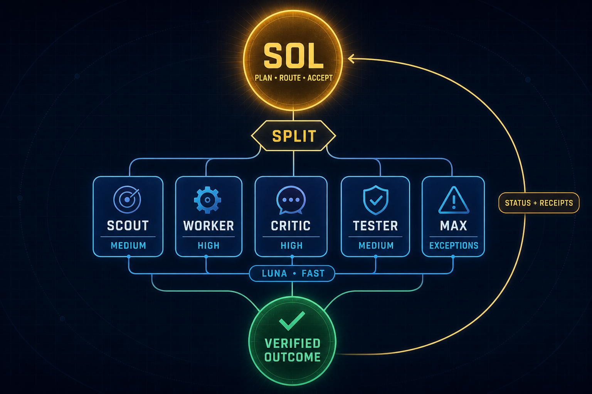

# Codex Sol/Luna Orchestration Kit

**Sol leads. Luna specializes. Every milestone ends in evidence.**

The advanced V0.2.2 orchestration and measurement edition for Codex. GPT-5.6
Sol owns planning, routing, integration, and final acceptance; dynamically
routed GPT-5.6 Luna Fast roles scout, build, challenge, and test within explicit
boundaries.

<p align="center">
  
</p>

> [!IMPORTANT]
> V0.2 milestones M0–M3 are implemented and verified. The first M4 single-pair
> benchmark started its all-Max control arm but was interrupted before a
> terminal result; the dynamic arm never started. That pair is permanently
> retired and provides no policy comparison or savings claim. M4 is terminal;
> its negative result constrains M5 but does not leave the retired experiment
> open.

V0.2.2 adds one compatibility variable without retuning models: every Luna
spawn is context-free (`fork_turns = "none"`), receives a self-contained task
packet, and fails directly to Sol without a spawn retry. The frozen V0.2.1 M4
inputs and immutable all-Max control bundle remain unchanged.

The incident audit attributed at least 178,564 root tokens to the incomplete
control workflow; child usage and total arm usage remain unknown. Automatic
promotion stayed off. The harness is now hardened around durable lifecycle
evidence, interruption receipts, immutable runtime configuration, and explicit
Codex capability checks before any new comparison window is proposed.

M5 adds an optional, shareable plugin and a hook-covered spawn admission guard.
The guard checks context-free transport, routing-policy integrity, the complete
assignment envelope, and declared wave ownership before supported `Agent`
calls. It is a partial guardrail, not universal write enforcement. M5 did not
promote the policy, claim savings, add a dashboard, or send local evidence to
a hosted surface. M6 adds a selectable Standard configuration profile without
claiming a controlled cost comparison. See [M5 plugin and guardrails](docs/M5_PLUGIN_GUARDRAILS.md).

## Choose the right kit

| | [Original role kit](https://github.com/msinclair25/codex-sol-luna-role-kit) | This orchestration kit |
| --- | --- | --- |
| Best for | A small, simple Sol/Luna setup | Repeatable multi-agent engineering work |
| Routing | Lightweight role selection | Fail-closed SPLIT policy and dynamic reasoning |
| Roles | General Sol/Luna pairing | Scout, Worker, Critic, Tester, and exception-only Max |
| Evidence | Prompt-level reporting | Structured receipts, local status, and usage summaries |
| Operational weight | Minimal | More policy, validation, and coordination |

If you want simplicity, start with the original. Use this repository when the
extra control and evidence justify the orchestration overhead.

See [repository provenance](docs/PROVENANCE.md) for the curated-snapshot
boundary and excluded local artifacts.

## Quick start

For a first-time guided install on macOS or Linux, paste this in a terminal:

```sh
git clone --depth 1 https://github.com/msinclair25/codex-sol-luna-orchestration-kit.git && python3 codex-sol-luna-orchestration-kit/scripts/install.py
```

The installer previews its plan, asks before installing the core, then asks
separately about the optional local usage/status skill. It requires Python 3.11
or newer, launches no models, enables no telemetry, and sends no data over the
network.

To inspect the repository without installing anything, run its local checks:

```sh
git clone https://github.com/msinclair25/codex-sol-luna-orchestration-kit.git
cd codex-sol-luna-orchestration-kit
PYTHONDONTWRITEBYTECODE=1 python3 scripts/routing_policy.py verify --format json
PYTHONDONTWRITEBYTECODE=1 python3 -m unittest discover -s tests -v
```

Use the [guided installer](#guided-installer-recommended) for setup; the manual
steps remain available as a fallback. Model IDs, Fast access, and custom-agent
availability still depend on your Codex version, account, and workspace
policy.

Add `--luna-tier standard` to the guided command when you prefer normal Luna
service over Fast.

## Why this setup exists

Pairing Sol with Luna is already a popular Codex pattern. This kit adds the
part that tends to be missing: **explicit roles, ownership, permissions,
acceptance checks, and evidence contracts**.

| Role | Responsibility | Default access |
| --- | --- | --- |
| `luna_scout_{fast,standard}` | Map code, dependencies, logs, and documentation before edits | Luna, medium, read-only |
| `luna_worker_{fast,standard}` | Make one bounded change in explicitly owned files | Luna, high, workspace-write |
| `luna_critic_{fast,standard}` | Adversarially review correctness, security, regressions, and test gaps | Luna, high, read-only |
| `luna_tester_{fast,standard}` | Run a named validation plan and report evidence without repairing failures | Luna, medium, workspace-write |
| `luna_max_{fast,standard}` | Handle bounded read-only analysis or an enumerated exception | Luna, max, read-only |

The root remains `gpt-5.6-sol` with user-selected reasoning and Standard /
default service (the global `service_tier` stays unset). Each role TOML pins
`gpt-5.6-luna`; Fast roles set `service_tier = "fast"`, while Standard roles
omit the key and inherit normal service. Scout and Tester use `medium`, Worker
and Critic use `high`, and Max uses `max` reasoning.

The recommended flow is:

```text
Sol plans → Scout maps → Worker builds → Critic + Tester verify → Sol integrates
```

### Plan around accepted milestones

Use one Codex task for one coherent outcome that can end with a single
acceptance decision. Planning, implementation, validation, and fixes required
to satisfy that outcome stay together. Once the milestone is verified and
accepted, start a fresh task for the next version, feature, subsystem, or other
independently shippable outcome.

If an acceptance check is incomplete or fails, keep the remediation in the
current task until the milestone is verified and accepted.

Do not start a new task automatically just because planning ended. For a long
planning phase, create a compact execution capsule with the goal, constraints,
decisions, relevant areas, acceptance criteria, validation, and known risks.
Continue from that capsule or compact the current task. Only when compaction
cannot preserve a usable context should the capsule seed a clean execution
continuation. That handoff keeps the same milestone and acceptance decision; it
does not create a new milestone.

Examples:

- Build, debug, test, and verify Version 1 in the Version 1 task.
- Start a fresh task for Version 1.1 improvements after Version 1 is accepted.
- Keep regressions introduced by Version 1.1 in the Version 1.1 task.
- Split a very large release into independently verifiable milestones such as
  foundation, primary workflow, integrations, and release hardening.

This is a **policy-driven workflow**, not a hard-coded orchestrator. Sol still
decides when delegation is useful and explicitly spawns each role. The role
instructions improve consistency, but they are not a security boundary or a
guarantee that every task will use every role.

The versioned [routing policy](docs/ROUTING_POLICY.md) documents the static
contract and advisory evaluator. It applies the five SPLIT checks—Separate,
Provable, Large enough, Isolated, and Tier-appropriate—and sends any failed,
malformed, unsupported, or stale request directly to Sol.

### Stability before optimization

V0.2 is meant to be observed, not continuously tuned. The retired M4 pair froze
one fixture, one prompt, one held-out oracle, both policy configurations, the
rate card, and the decision thresholds before its control arm began. Its
inconclusive evidence must not be reused or combined with a future window.

An intervention requires a documented, observed correctness or security
failure or a predeclared quality kill criterion. It ends the comparable window;
make the smallest repair, capture a new immutable policy snapshot and hashes,
and start a fresh window rather than mixing before-and-after evidence.
Receipt summaries partition different control-bundle, routing-policy, and
rate-card hashes into separate cohorts and leave the combined efficiency metric
unknown.

At the checkpoint, test at most one policy change at a time against a stated
hypothesis, baseline, acceptance threshold, overhead budget, and rollback
condition. Keep it only with calibrated or replicated evidence and no quality
or latency regression. Otherwise keep the stable policy, simplify, or revert.
The goal is the minimum control required for consistently accepted outcomes,
not perpetual optimization.

The [M4 single-pair benchmark](docs/M4_BENCHMARK.md) documents the interrupted
run, its non-retry boundary, and the hardened runner requirements. No fresh
benchmark window is currently authorized. The [new Mac handoff](docs/NEW_MAC_HANDOFF.md)
is retained as historical setup evidence and must not be used to restart the
retired pair.

## What you get

```text
codex-sol-luna-orchestration-kit/
├── .agents/skills/sol-luna-status/
├── .gitignore
├── README.md
├── LICENSE
├── SECURITY.md
├── AGENTS.md
├── AGENTS.override.md
├── assets/
│   ├── sol-luna-orchestration-system.png
│   └── social-preview.jpg
├── benchmark/m4_single_pair/
│   ├── PROMPT.txt
│   ├── oracle.py
│   └── fixture/
├── config-snippet.toml
├── config/
│   ├── install-assets.v1.json
│   ├── m4-benchmark.v1.json
│   ├── m4-pilot.v1.json
│   ├── rate-card.v1.json
│   ├── routing-policy.v1.json
│   ├── routing-policy.v1.1.json
│   └── routing-policy.standard.v1.1.json
├── control-bundles/
│   └── all-max-v1/
├── schemas/
│   ├── m4-benchmark-receipt.v1.schema.json
│   ├── m4-benchmark-terminal.v1.schema.json
│   ├── m4-pilot-plan.v1.schema.json
│   ├── milestone-receipt.v1.schema.json
│   └── pilot-start.v1.schema.json
├── docs/
│   ├── CONTROL_BUNDLES.md
│   ├── M4_BENCHMARK.md
│   ├── M4_PILOT.md
│   ├── M5_PLUGIN_GUARDRAILS.md
│   ├── INSTALLING_AND_UPDATING.md
│   ├── NEW_MAC_HANDOFF.md
│   ├── RECEIPTS.md
│   ├── PROVENANCE.md
│   ├── ROUTING_POLICY.md
│   ├── STATUS_SKILL.md
│   └── USAGE_METRICS.md
├── evidence/
│   ├── m1-role-smoke-2026-08-02.json
│   └── m4-v0.2.1-single-pair-01-retired.json
├── pilot-plans/
│   └── m4-v0.2.1-window-01.json
├── scripts/
│   ├── install.py
│   ├── new_mac_preflight.py
│   ├── pilot_tool.py
│   ├── run_m4_benchmark.py
│   ├── receipt_tool.py
│   ├── routing_policy.py
│   ├── usage_report.py
│   └── verify_control_bundle.py
├── plugins/
│   └── sol-luna-orchestration-kit/
│       ├── .codex-plugin/plugin.json
│       ├── hooks/hooks.json
│       ├── skills/
│       └── scripts/pre_tool_use_guard.py
├── profiles/standard/
│   ├── AGENTS.override.md
│   └── config-snippet.toml
├── tests/
│   ├── test_control_bundle.py
│   ├── test_install.py
│   ├── test_m1_evidence.py
│   ├── test_m4_benchmark.py
│   ├── test_new_mac_preflight.py
│   ├── test_pilot_tool.py
│   ├── test_receipt_tool.py
│   ├── test_routing_policy.py
│   ├── test_sol_luna_status.py
│   ├── test_usage_report.py
│   └── fixtures/
└── agents/
    ├── luna_max_fast.toml
    ├── luna_scout_fast.toml
    ├── luna_worker_fast.toml
    ├── luna_critic_fast.toml
    ├── luna_tester_fast.toml
    ├── luna_max_standard.toml
    ├── luna_scout_standard.toml
    ├── luna_worker_standard.toml
    ├── luna_critic_standard.toml
    └── luna_tester_standard.toml
```

## Compatibility and expectations

The checked-in policy and static tests cover the role contract and routing
decisions. No live spawn result is promised: model IDs, reasoning levels, Fast
access, feature flags, concurrency, and CLI diagnostics can vary by Codex
version, account, workspace policy, and rollout. The benchmark harness records
the observed Codex version but gates on the concrete CLI flags and event
contract it needs instead of assuming one release remains current forever.
Once a future pair begins, that version and executable digest stay pinned
across both arms. Missing or changed capabilities fail before measured work.
Seeing a model in an
API account does not necessarily mean the same model is enabled in every Codex
surface. Verify your own model picker or model catalog before installing.
The active V0.2.2 contract requires context-free Luna launches; a task that
cannot be expressed as a self-contained packet stays with Sol. The original
V0.2.1 `AGENTS.md` and routing-policy file remain as frozen M4 inputs, while
`AGENTS.override.md` and `routing-policy.v1.1.json` define new installations.
The advisory evaluator requires callers to provide `fork_turns` explicitly;
omission and history-fork values fail closed. It does not parse free-form task
prose, so Sol still owns the judgment that a child packet is self-contained.
The static verifier requires Python 3.11 or newer; older runtimes fail closed
with a clear diagnostic because the policy relies on stdlib `tomllib`.

### Luna support boundary

As of August 3, 2026, OpenAI's
[subagent guide](https://learn.chatgpt.com/docs/agent-configuration/subagents)
explicitly recommends `gpt-5.6-luna` for fast, narrowly scoped agents and
includes Luna custom-agent examples. At the same time, the open-source Codex
[model catalog](https://github.com/openai/codex/blob/main/codex-rs/models-manager/models.json)
labels Sol and Terra as multi-agent V2 and Luna as V1, while the
[V2 child-model filter](https://github.com/openai/codex/blob/main/codex-rs/core/src/tools/handlers/multi_agents_common.rs)
requires a requested child model to match the active multi-agent backend.
That makes Sol-to-Luna custom-role launches a version-, account-, and
workspace-dependent compatibility boundary rather than a universal guarantee.

This kit does not replace or edit Codex's model catalog. It narrows Luna to
bounded, context-free lanes, prohibits nested Luna delegation, and routes a
rejected spawn directly back to Sol without retrying or silently substituting
a model. Work that depends on proactive child-to-child coordination or hidden
conversation history stays with Sol.

### Evidence so far

| Evidence | Result | What it establishes |
| --- | --- | --- |
| Static policy and installer tests | Passing on the V0.2.2 branch | The checked-in configuration is internally consistent; this is not proof of runtime availability. |
| [M1 role smoke](evidence/m1-role-smoke-2026-08-02.json) | All five Luna roles launched and completed on the tested account and Codex build | The configured roles worked in one observed environment. |
| Maintainer operational sample (August 3, 2026 snapshot) | 63 of 64 privacy-safe named Luna role runs completed | Practical reliability evidence from mixed work; completion does not prove correctness or savings. |
| M4 matched comparison | Interrupted control; dynamic arm not started; pair retired | No verified whole-workflow savings percentage exists yet. |

The working economic hypothesis remains that dynamic reasoning and better Sol
focus can reduce weighted usage on suitable workflows. The previous 20% figure
is a benchmark target, not a result or promise. A new claim requires a fresh,
predeclared comparison with quality and latency non-inferiority; ordinary use
is useful reliability evidence but is not a controlled A/B test.

Subagents generally use **more total tokens** than an equivalent single-agent
run because every child performs its own model and tool work. This setup is for
better throughput, cleaner parent context, specialization, and independent
evidence—not guaranteed token or cost savings. Delegate only when the work can
be divided cleanly enough to justify the coordination overhead.

## Usage metrics

Yes—this kit includes an optional, privacy-safe local report for seeing how
Sol and the Luna roles are actually being used:

```sh
python3 scripts/usage_report.py --since 2026-08-01
```

It summarizes runs by role/model/tier, recorded token fields, active time,
tool calls, completion events, and observed concurrency. It reads local Codex
session records without sending data anywhere and omits prompts, messages,
paths, IDs, tool arguments, and command output from its report.

Codex also exposes official OpenTelemetry metrics for turn token usage,
latency, tool calls, and multi-agent spawns. See the [usage-metrics
guide](docs/USAGE_METRICS.md) for the local command, optional OTLP export,
privacy boundaries, and interpretation caveats. This repository does not ship
a telemetry server or dashboard.

The local JSONL adapter is best-effort because session persistence is not a
public stable API. Neither report is provider billing, and neither proves cost
savings without a comparable baseline.

## Optional plugin and spawn guard

The repository now includes a source plugin at
`plugins/sol-luna-orchestration-kit`. It packages the orchestration and status
skills plus an opt-in `PreToolUse` hook for supported `Agent` calls. The core
installer is still required for custom role TOMLs and global Sol instructions;
the plugin does not silently modify either surface.

For workflow-only installation from GitHub:

```sh
codex plugin marketplace add msinclair25/codex-sol-luna-orchestration-kit
codex plugin add sol-luna-orchestration-kit@sol-luna
```

The plugin supports both `fast` and `standard` routing envelopes. See the
[install and update guide](docs/INSTALLING_AND_UPDATING.md) for marketplace
updates and the full-role installer.

Validate the bundle before local marketplace installation or publication:

```sh
python3 /path/to/plugin-creator/scripts/validate_plugin.py plugins/sol-luna-orchestration-kit
PYTHONDONTWRITEBYTECODE=1 python3 -m unittest tests.test_m5_plugin -v
```

Plugin hooks require explicit trust review and can be disabled. Current hook
inputs cannot universally attribute every later write to a specific child, so
the hook enforces spawn admission and declared ownership—not actual filesystem
ownership after launch. See the [M5 coverage and bypass limits](docs/M5_PLUGIN_GUARDRAILS.md#coverage-and-bypass-limits).

## Milestone receipts

M2 adds a local, unsigned audit receipt flow. Close a validated milestone into
`.sol-luna/receipts/`, validate receipt files, or summarize observed terminal
receipts without exposing prompts, source, tool payloads, credentials, or raw
traces:

```sh
python3 scripts/receipt_tool.py close --input receipt-input.json
python3 scripts/receipt_tool.py validate --receipts-dir .sol-luna/receipts
python3 scripts/receipt_tool.py summarize --receipts-dir .sol-luna/receipts --format json
```

Receipts are local audit artifacts, not automation commands or cryptographic
proof. Their SHA-256 IDs are anchored by the canonical close payload; Git and
human review remain the provenance anchor. M2 summaries alone cannot infer
coverage. The retained observational registry computes coverage only by
joining pre-registered starts to matching terminal receipts; see the
[legacy pilot protocol](docs/M4_PILOT.md). The retired single-pair benchmark
was interrupted before producing a comparison receipt and is now
permanently non-retryable.

## Sol/Luna status skill

Run the repository-local, read-only status report with
`python3 .agents/skills/sol-luna-status/scripts/sol_luna_status.py`; add
`--format json` for automation. The bounded scanner uses validated local
receipts and attributable record-schema-v1 rollout JSONL with complete token
snapshots, redacts sensitive content, and falls back to receipt-only status
when local session capability or correlation is not provable. M4 now reports
terminal and non-retryable by default with no next slot. Historical registry
inspection requires the explicit audit-only flag plus a plan and never
authorizes registration or model work. The report itself remains local and
uses no server, MCP service, dashboard, database, or network surface; M5 can
distribute the same workflow in the optional plugin.

The guided installer offers this as a separate opt-in personal skill under
`~/.agents/skills/sol-luna-status`. Choosing no installs only the core routing
kit. Choosing yes still does not read session records during installation;
local data is inspected only when you later invoke the status or usage tools.

## Installation

There are now two supported paths:

- **Workflow-only:** install the Git-backed plugin for the skills, status, and
  optional guard without changing global roles or instructions.
- **Full roles:** use the guided installer for custom Luna roles, global Sol
  policy, backups, state-tracked updates, and a Fast or Standard tier choice.

See [Installing and updating](docs/INSTALLING_AND_UPDATING.md) for the concise
decision guide and exact update commands.

### Guided installer (recommended)

From an existing checkout, run:

```sh
python3 scripts/install.py
```

Fast Luna is the compatibility default. Choose Standard Luna explicitly:

```sh
python3 scripts/install.py --luna-tier standard
```

It performs the following bounded flow:

1. Verifies the checked-in core routing policy and all five role files before
   any write.
2. Prints a JSON preview and asks whether to install the core roles,
   instructions, and owned configuration keys.
3. Preserves unrelated `config.toml` settings and existing global instructions.
   A non-empty `AGENTS.override.md` is updated because that is the active global
   instruction file; otherwise the managed policy is placed in `AGENTS.md`.
4. Backs up every replaced file under
   `~/codex-config-backups/sol-luna-<unique-id>/`, writes an installation
   receipt listing every created or replaced relative path, and verifies the
   installed active root.
5. Separately asks whether to install the optional privacy-safe local
   usage/status skill and hash-verifies its three installable assets. It never
   enables OTLP or another telemetry exporter.
6. Records only managed-asset hashes and the chosen tier in
   `~/.codex/.sol-luna-install-state.json` so later updates can distinguish an
   unchanged managed file from a user edit.

Core and optional usage are separate transactions. If the optional phase is
declined or blocked, the already verified core remains installed and the
optional phase can be retried independently. Failed transactions are rolled
back; their printed backup directory is retained as a recovery artifact.

Existing conflicting role files or owned configuration values fail closed.
Compare them before deliberately rerunning with `--approve-conflicts`. Use
`--approve-agents-refresh` only to replace a byte-exact known prior kit policy
or refresh a managed policy block installed by an earlier kit version. A
modified unmarked instruction file is never treated as a known revision.
Neither flag bypasses symlink, malformed TOML, marker, size, source-integrity,
or post-install verification checks.

Source-integrity checks detect accidental or unreviewed drift against the
manifests in a trusted checkout; they do not authenticate a maliciously
modified repository. Obtain the checkout from the project repository and
review the installer before running it.

For a no-write preview:

```sh
python3 scripts/install.py --dry-run --without-usage
```

For non-interactive automation, the usage choice is mandatory:

```sh
python3 scripts/install.py --apply --without-usage
# Or explicitly opt in:
python3 scripts/install.py --apply --with-usage
# Standard Luna instead of Fast:
python3 scripts/install.py --apply --luna-tier standard --with-usage
```

For M6+ updates, pull the trusted checkout and reuse the recorded tier and
usage choice:

```sh
git pull --ff-only
python3 scripts/install.py --update
```

Update mode fails closed when a managed file no longer matches the recorded
hash. Switch profiles with `--update --luna-tier standard` or
`--update --luna-tier fast`.

The optional personal skill keeps a local pointer to this checkout. Keep the
checkout in place. After moving it, refresh only that installer-owned pointer:

```sh
python3 scripts/install.py --apply --with-usage --refresh-usage-pointer
```

The guided global installer rejects filesystem roots and broad destinations;
the selected Codex home must be a proper child of the supplied home directory.

### Paste into Codex

You can paste this request into a Codex task instead of entering shell steps
yourself:

```text
Install the Codex Sol/Luna Orchestration Kit globally from
https://github.com/msinclair25/codex-sol-luna-orchestration-kit. If I do not
already have a trusted checkout, clone it into a permanent local folder. Read
scripts/install.py, run it interactively, show me its preview, and relay its
Fast-or-Standard tier, core, and optional usage/status questions without
choosing for me. Do not
enable telemetry, install a plugin, overwrite a conflict, or remove unrelated
Codex settings or instructions without my explicit approval. When finished,
show me the verification result plus backup and receipt paths, then remind me
to restart Codex.
```

### Manual installation

#### 1. Download the kit

Clone the repository and open a terminal inside it:

```sh
git clone https://github.com/msinclair25/codex-sol-luna-orchestration-kit.git
cd codex-sol-luna-orchestration-kit
```

You can also use GitHub's **Code → Download ZIP** button.

#### 2. Back up your existing Codex configuration

Do not replace your full Codex configuration. Preserve existing project trust,
permissions, plugins, MCP servers, notifications, profiles, and instructions.

On macOS or Linux, create a unique backup outside `~/.codex`:

```sh
mkdir -p "$HOME/codex-config-backups"
SOL_LUNA_BACKUP_DIR="$(mktemp -d "$HOME/codex-config-backups/sol-luna-XXXXXXXX")"
test ! -e ~/.codex/config.toml || cp -p ~/.codex/config.toml "$SOL_LUNA_BACKUP_DIR/config.toml"
test ! -e ~/.codex/AGENTS.md || cp -p ~/.codex/AGENTS.md "$SOL_LUNA_BACKUP_DIR/AGENTS.md"
test ! -e ~/.codex/AGENTS.override.md || cp -p ~/.codex/AGENTS.override.md "$SOL_LUNA_BACKUP_DIR/AGENTS.override.md"
test ! -d ~/.codex/agents || cp -Rp ~/.codex/agents "$SOL_LUNA_BACKUP_DIR/agents"
echo "Backup: $SOL_LUNA_BACKUP_DIR"
```

On Windows PowerShell:

```powershell
$timestamp = Get-Date -Format "yyyyMMdd-HHmmss"
$backupDir = Join-Path $HOME "codex-config-backups\sol-luna-$timestamp"
$codexDir = Join-Path $HOME ".codex"
New-Item -ItemType Directory -Path $backupDir | Out-Null
if (Test-Path (Join-Path $codexDir "config.toml")) {
    Copy-Item (Join-Path $codexDir "config.toml") $backupDir
}
if (Test-Path (Join-Path $codexDir "AGENTS.md")) {
    Copy-Item (Join-Path $codexDir "AGENTS.md") $backupDir
}
if (Test-Path (Join-Path $codexDir "AGENTS.override.md")) {
    Copy-Item (Join-Path $codexDir "AGENTS.override.md") $backupDir
}
if (Test-Path (Join-Path $codexDir "agents")) {
    Copy-Item (Join-Path $codexDir "agents") $backupDir -Recurse
}
Write-Host "Backup: $backupDir"
```

Keep the printed backup path until you have completed validation.

#### 3. Install the custom roles

Run these commands from inside the extracted kit directory. Existing roles are
never silently overwritten:

```sh
mkdir -p ~/.codex/agents
for roleFile in agents/*.toml; do
  roleName=$(basename "$roleFile")
  if [ -e ~/.codex/agents/"$roleName" ]; then
    echo "Already exists; compare before replacing: $roleName"
  else
    cp "$roleFile" ~/.codex/agents/"$roleName"
  fi
done
```

PowerShell:

```powershell
$kitDir = (Get-Location).Path
$agentsDir = Join-Path $HOME ".codex\agents"
New-Item -ItemType Directory -Force -Path $agentsDir | Out-Null
Get-ChildItem (Join-Path $kitDir "agents\*.toml") | ForEach-Object {
    $destination = Join-Path $agentsDir $_.Name
    if (Test-Path $destination) {
        Write-Warning "Already exists; compare before replacing: $($_.Name)"
    } else {
        Copy-Item $_.FullName $destination
    }
}
```

Custom agents placed under `~/.codex/agents/` apply globally. To scope the
roles to one trusted repository instead, place them under that project's
`.codex/agents/` directory. The commands above install both the `*_fast` and
`*_standard` aliases; the instruction policy in the next step selects which
set is active.

#### 4. Merge the routing policy

If a non-empty `~/.codex/AGENTS.override.md` exists, manually merge the
**Role-based subagent policy** section there because Codex gives it precedence.
Otherwise, use `AGENTS.override.md` for Fast Luna or
`profiles/standard/AGENTS.override.md` for Standard Luna. Copy the selected
policy to `~/.codex/AGENTS.md` when absent, or merge it into the existing file.
Do not overwrite unrelated instructions. The shell examples below show the
Fast/default path; substitute the Standard profile path when desired.

macOS or Linux:

```sh
if [ -s "$HOME/.codex/AGENTS.override.md" ]; then
  echo "Merge the policy into $HOME/.codex/AGENTS.override.md"
elif [ -e "$HOME/.codex/AGENTS.md" ]; then
  echo "Merge the policy into $HOME/.codex/AGENTS.md"
else
  cp AGENTS.override.md "$HOME/.codex/AGENTS.md"
fi
```

PowerShell:

```powershell
$override = Join-Path $HOME ".codex\AGENTS.override.md"
$destination = Join-Path $HOME ".codex\AGENTS.md"
if ((Test-Path $override) -and (Get-Content $override -Raw).Trim()) {
    Write-Host "Merge the policy into $override"
} elseif (Test-Path $destination) {
    Write-Host "Merge the policy into $destination"
} else {
    Copy-Item (Join-Path (Get-Location).Path "AGENTS.override.md") $destination
}
```

A more-specific project `AGENTS.md` can refine the global policy for that
repository.

#### 5. Merge the Codex settings

Open `~/.codex/config.toml` and merge the relevant values from
`config-snippet.toml` for Fast or `profiles/standard/config-snippet.toml` for
Standard:

```toml
model = "gpt-5.6-sol"
model_reasoning_effort = "xhigh"

[features]
fast_mode = true
multi_agent = true

[agents]
max_concurrent_threads_per_session = 3
```

Important details:

- Do not replace the complete file.
- The guided installer preserves an existing non-empty
  `model_reasoning_effort`; `xhigh` is only the default when that preference is
  absent.
- If `[features]` already exists, add the keys to that table. TOML cannot have
  two `[features]` tables.
- To keep Sol on Standard/default service, leave the top-level `service_tier`
  unset. If you already set a top-level tier, changing or removing it changes
  your existing preference; do that only intentionally.
- Keep `max_concurrent_threads_per_session = 3`; the policy caps concurrently
  active delegated lanes at three and processes dependent work in waves.
- The selected policy chooses either the `*_fast` roles, which explicitly pin
  Fast, or the `*_standard` roles, which omit a service-tier override.
- Do not initially add `agents.default_subagent_model`. Each role already pins
  Luna directly, and some tested desktop builds rejected Luna custom-agent
  launches when that global default was present.

#### 6. Restart Codex

Fully quit and reopen the Codex desktop app. For the CLI, exit the current
session and start a new one. Create a new task so the global instructions and
custom-agent catalog load cleanly. Signing out is normally unnecessary.

## Validation

### Confirm the models

Use the Codex model picker, or use the following CLI diagnostics when your
Codex version provides them:

```sh
codex --version
codex debug models
```

Confirm that `gpt-5.6-sol` and `gpt-5.6-luna` are available. If a command is
unrecognized, use the model picker instead; CLI diagnostics are version
dependent.

### Test Luna directly

The safest desktop check is a new task using GPT-5.6 Luna with this prompt:

```text
Reply with exactly: luna-direct-ok
```

Optional CLI smoke test from an empty temporary directory:

```sh
mkdir -p /tmp/codex-luna-smoke
cd /tmp/codex-luna-smoke
codex exec --ephemeral \
  --skip-git-repo-check \
  -m gpt-5.6-luna \
  -c model_reasoning_effort=max \
  -c service_tier=fast \
  "Reply with exactly: luna-direct-ok"
```

`--skip-git-repo-check` is used only because this isolated smoke-test directory
is intentionally not a Git repository. The test consumes model quota.

### Test a custom subagent

First verify the checked-in dynamic contract without launching a role:

```sh
PYTHONDONTWRITEBYTECODE=1 python3 scripts/routing_policy.py verify --format json
```

The report should contain `runtime_root_match: true`. This is a static,
fail-closed advisory check and does not prove that the current account can
launch every role.

If you have confirmed access in your Codex model picker, start a new Sol task
and enter (the Max exception reason is explicit):

```text
Spawn a luna_max_fast subagent for a bounded read-only analysis with max
upgrade reason `genuine_ambiguity` and `fork_turns` set explicitly to `none`.
Give it a self-contained task: calculate 6 × 7 and return only the integer.
Wait for it and report the result. Do not retry if the spawn is rejected.
```

Expected result: `42`.

For a more complete, explicitly bounded check:

```text
Use the custom Luna roles to run a read-only smoke test. Set `fork_turns` to
`none` explicitly on every spawn and give each child a self-contained task.
Have Scout inspect a tiny specification, Worker describe—but not make—a bounded
change, Critic review the proposal, and Tester validate an explicit acceptance
condition. Wait for every role and report each status. Do not retry a rejected
spawn. Treat runtime model, reasoning, and tier metadata as observational only;
the static contract remains authoritative for policy validation.
```

Every direct or child test can consume quota. Fast and Max availability and
limits depend on the account and workspace.

## Routing rules that matter

The active `AGENTS.override.md` gives the Sol root these operating rules:

1. Delegate only independent, bounded work that materially improves speed or
   accuracy.
2. Pass every candidate through SPLIT: Separate, Provable, Large enough,
   Isolated, and Tier-appropriate. Any failed or unknown check routes directly
   to Sol.
3. Give every child an outcome, relevant inputs, ownership or read-only scope,
   constraints, acceptance checks, evidence requirements, and a deadline.
4. Explicitly use `fork_turns = "none"` for Luna, pass a self-contained task,
   and route a rejected spawn directly to Sol without retrying or substitution.
5. Never run overlapping writers concurrently; exact and directory-prefix
   ownership conflicts are rejected.
6. Serialize dependent work in waves; parallelize independent review and
   validation, with no more than three concurrently active lanes. Total lanes
   and waves are not capped by this policy.
7. Keep commits, pushes, deployments, migrations, destructive cleanup, and
   other external effects with Sol unless the user explicitly authorizes them.
8. Require compact evidence from every role—`scope`, `files_or_surfaces`,
   `commands_or_checks`, `assumptions`, `failures`, `risks`, `confidence`, and
   `recommendation`—and independently verify material
   claims before the final answer.

The practical default is one Worker at a time, followed by Critic and Tester in
parallel. Trivial tasks should remain with Sol because orchestration overhead
can be slower and noisier than doing the work directly. Max is only selected
for the enumerated exception codes in `AGENTS.override.md`, including for general
analysis.

## Safety and privacy

- Review every role file before installing it.
- Do not delegate secrets, `.env` contents, credentials, private keys, access
  tokens, customer data, or production data/logs.
- `sandbox_mode` and role instructions reduce accidental scope, but subagents
  inherit or interact with the parent session's actual permission policy. They
  are not a substitute for OS, repository, or workspace security controls.
- Worker and Tester use `workspace-write`; Worker may edit only explicitly
  assigned files, while Tester may produce unavoidable test/build artifacts.
- The root agent keeps responsibility for final verification and external
  side effects.

See [SECURITY.md](SECURITY.md) for the public-reporting policy.

## Troubleshooting

### `Unknown model gpt-5.6-luna for spawn_agent`

1. Remove `agents.default_subagent_model` from `~/.codex/config.toml`.
2. Keep the model inside each custom role TOML.
3. Fully quit and reopen Codex.
4. Retest direct Luna, then `luna_max_fast`.

If direct Luna works but a custom Luna agent does not, the likely issue is the
current launcher/model registry or workspace policy—not the role prompt itself.
Do not repair a rejected custom-role spawn by omitting `fork_turns` or using a
full-history fork. Start from a self-contained `fork_turns = "none"` request;
if that is rejected, keep the work with Sol and record the compatibility issue.

### Custom roles are missing

Check that:

- Files are under `~/.codex/agents/` for global use or `.codex/agents/` for the
  trusted project.
- Every TOML defines `name`, `description`, and `developer_instructions`.
- The filenames and `name` fields are easy to match.
- Codex was fully restarted and the test uses a new task.

### Two entries named GPT-5.6 Luna appear

Some model catalogs may expose the public Luna model and another internal role
or alias with the same display name. The supplied role files explicitly select
`gpt-5.6-luna`; duplicate display labels do not mean this kit installed the
model twice.

### Luna or Fast is unavailable

Update Codex and confirm availability in the model picker. Access can vary by
account, workspace, surface, version, and rollout. If your environment uses a
different supported model or tier, edit each role TOML deliberately and test
the replacement before relying on it.

## Rollback

The guided installer prints its unique backup directory and receipt. Backups
preserve original paths beneath `codex-home/` and `home/`; newly created files
have no prior copy and are identified by the install plan. Fully quit Codex
before restoring them.

1. Fully quit Codex.
2. Restore `config.toml` and the active `AGENTS.md` or `AGENTS.override.md`
   from the unique backup directory when those files existed before
   installation. If a file was absent and created solely for this kit, remove
   only that newly created file instead.
3. Restore the previous `agents` directory when one existed. Otherwise, remove
   only the selected `*_fast` or `*_standard` role files introduced by this
   kit—do not delete unrelated custom agents.
4. If you opted into the personal status skill, restore its backed-up files or
   remove only `~/.agents/skills/sol-luna-status` when the installer created it.
5. Reopen Codex and create a new task.

Restore the backed-up `.sol-luna-install-state.json` together with the other
Codex-home files. If the installer created it for the first time, remove only
that file during a complete rollback.

This setup does not store or delete project source code. Rollback affects only
the Codex configuration files you changed.

## Official documentation

- [Codex subagents and custom agents](https://learn.chatgpt.com/docs/agent-configuration/subagents)
- [Codex configuration reference](https://learn.chatgpt.com/docs/config-file/config-reference#configtoml)
- [Codex environment variables and `CODEX_HOME`](https://learn.chatgpt.com/docs/config-file/environment-variables)

## Share the project

Use the repository-ready [1280×640 social preview](assets/social-preview.jpg)
for link cards and launch posts. It uses the same Sol-gold, Luna-cyan, and
verified-emerald visual language as the architecture image above.

## License

MIT. See [LICENSE](LICENSE).

This community configuration kit is not an official OpenAI project. OpenAI,
Codex, GPT, Sol, and Luna are trademarks or product names of their respective
owner.
