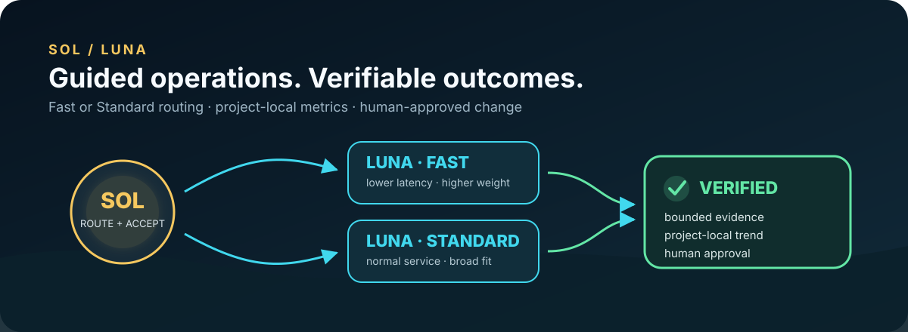

# Codex Sol/Luna Orchestration Kit

[](https://github.com/msinclair25/codex-sol-luna-orchestration-kit/actions/workflows/ci.yml)
[](https://github.com/msinclair25/codex-sol-luna-orchestration-kit/releases/latest)
[](LICENSE)



**Put Sol in charge. Give Luna the right jobs.**

Codex Sol/Luna is a released, installable orchestration kit that turns Codex
multi-agent work into a disciplined team workflow. Sol owns the requirements,
architecture, integration, and final decision. Five specialized Luna roles take
on substantial, bounded work only when it passes a deny-by-default routing gate.

[V0.6.0](https://github.com/msinclair25/codex-sol-luna-orchestration-kit/releases/tag/v0.6.0)
is ready for real-project testing. It includes guided setup and updates,
Fast/Standard Luna profiles, conflict-safe managed configuration, drift checks,
resumable operations, and privacy-safe project metrics that can reveal
usage-efficiency signals without pretending to prove savings.

## Quick Start

Choose a Luna tier before setup:

| Tier | Best fit | Tradeoff |
| --- | --- | --- |
| **Fast** | Lower-latency Luna work when Fast is available | Requires Fast availability and uses higher weighted usage |
| **Standard** | Normal service with broader compatibility | Potentially slower |

Requirements: a current Codex build with plugin support; custom-agent support
for the full-role profile; and Python 3.11 or newer for setup and verification.
Fast access is optional—the Standard profile uses normal service.

Paste this six-line prompt into one Codex task. Replace `Fast` with `Standard`
if preferred:

```text
Install and fully configure the Sol/Luna Orchestration Kit with Fast Luna.
Use https://github.com/msinclair25/codex-sol-luna-orchestration-kit, marketplace sol-luna, and plugin sol-luna-orchestration-kit@sol-luna.
Verify `codex plugin list --json` and use only the matching installed `source.path`.
Read its setup skill and finish preview, install, backup, and verification in this task.
Preserve my settings; stop and explain conflicts; require no intermediate restart.
Tell me when one final restart is required after verification.
```

The setup skill verifies the installed source, previews every managed change,
preserves unrelated settings, creates a recovery receipt, applies the selected
profile transactionally, and verifies the result. Restart only when it reports
a verified changed install.

### Workflow-only alternative

Want to try the workflow before enabling custom global roles? Install the
Git-backed plugin by itself:

```sh
codex plugin marketplace add msinclair25/codex-sol-luna-orchestration-kit
codex plugin add sol-luna-orchestration-kit@sol-luna
```

Restart Codex once so it loads the plugin. You will get the skills, routing
workflow, status, and optional spawn guard without global instructions, config
keys, or role TOMLs. Status clearly identifies this as **Workflow-only** and
offers the full role profile as an optional upgrade.

## What the kit gives you

- **Focused delegation.** Sol keeps small or tightly coupled work and sends
  only independently separable, provable, substantial work to Luna.
- **Five purpose-built roles.** Scout maps, Worker implements, Critic challenges,
  Tester validates, and Max handles explicitly justified exceptional analysis.
- **Fast or Standard routing.** Pick lower latency or broader compatibility;
  switch later through the same guided workflow.
- **Trustworthy handoffs.** Every lane has bounded scope, non-overlapping
  ownership, acceptance checks, and a compact evidence packet for Sol to verify.
- **Safe lifecycle operations.** Previewed installation, conflict detection,
  backups, resumable updates, source verification, and drift reporting are built
  into the kit.
- **Useful local metrics.** See delegation volume, usefulness, failures, and
  attributable token trends for the active project—without hosted telemetry or
  a scan of every workspace.

## Help test V0.6.0

The release is finished; the next job is learning how it behaves across more
real codebases, Codex configurations, and workloads. A useful test session can
be as simple as:

1. Install the full profile or the workflow-only alternative.
2. Run `$sol-luna-status Show my status.` and confirm the reported mode and tier.
3. Give Codex one substantial task with separable implementation, review, or
   validation work.
4. Check whether routing felt selective, ownership stayed clear, and the final
   answer included evidence you could trust.
5. Return to status after several delegated outcomes to inspect project-local
   usage and usefulness signals.

Use the [V0.6 tester guide](CONTRIBUTING.md#test-v060), then
[open a structured tester feedback report](https://github.com/msinclair25/codex-sol-luna-orchestration-kit/issues/new?template=tester-feedback.yml)
with your Codex version, operating system, selected tier, install mode, what you
expected, and what happened. Sanitized status output is helpful. Never include
credentials, customer data, private prompts, production logs, or sensitive
source code.

## Conversational command card

| Action | Say in Codex |
| --- | --- |
| Setup | `$sol-luna-setup Set me up using Fast.` |
| Status | `$sol-luna-status Show my status.` |
| Update | `$sol-luna-setup Update.` |
| Continue | `$sol-luna-setup Continue.` |
| Switch | `$sol-luna-setup Use Standard.` or `Use Fast.` |
| Verify | `$sol-luna-setup Verify.` |
| Settings | `$sol-luna-setup Show my settings.` |

Updates are resumable. If an operation stops, the setup Doctor identifies the
current phase and tells you whether to retry, restart, or continue in a new task.

## How routing stays disciplined

Sol delegates only when a task is independently separable, provable, large
enough, ownership-isolated, and tier-appropriate. Small questions, status,
Git-only work, one-command diagnostics, localized edits, formatting, and
straightforward test reruns stay with Sol.

| Role kind | Fast role | Standard role | Reasoning | Sandbox |
| --- | --- | --- | --- | --- |
| Scout | `luna_scout_fast` | `luna_scout_standard` | Medium | Read-only |
| Worker | `luna_worker_fast` | `luna_worker_standard` | High | Workspace-write |
| Critic | `luna_critic_fast` | `luna_critic_standard` | High | Read-only |
| Tester | `luna_tester_fast` | `luna_tester_standard` | Medium | Workspace-write |
| Max | `luna_max_fast` | `luna_max_standard` | Max | Read-only |

Both profiles keep Sol on `gpt-5.6-sol`, preserve the user's selected reasoning
level, and leave Sol's global service tier unset. Standard Luna roles inherit
normal service; Fast roles pin Fast. Native Luna is the default transport. The
documented Codex app fallback is limited to eligible pre-start transport
failures and requires explicit authorization for the exact lane and checkout.

See the [routing policy](docs/ROUTING_POLICY.md) and
[plugin guardrails](docs/M5_PLUGIN_GUARDRAILS.md) for the closed enums,
ownership rules, and transport boundary.

## Project-local usage and outcome metrics

V0.6.0 ships the complete project-local metrics layer for attributable Sol/Luna
work. The default status stays compact; `--detail` adds installation, metrics,
drift, and provenance detail.

Healthy full install:

```text
Health: Healthy
Version: 0.6.0 · Fast
Metrics: 12 delegated outcomes in the last 30 days
Delegation: 9/12 accepted as useful · 1 failed
Trend: Not enough comparable evidence yet.
Next: No lifecycle action needed; no policy change suggested.
```

Normal low-sample result:

```text
Metrics: Ready; no dated delegated outcomes in the last 30 days
Delegation: No current outcomes to evaluate yet
Trend: Not enough comparable evidence yet.
```

The metrics are designed to help answer practical questions: Are useful
delegated outcomes increasing? Are failures clustering by role or task kind?
When tokens are attributable, is token use per accepted outcome moving in the
right direction within the same policy cohort?

Records stay under the active project's `.sol-luna` directory. They use closed
routing fields, usefulness, terminal outcome, bounded generic checks, and
optional attributable total tokens. They exclude paths, project names,
task/thread IDs, prompts, commands, evidence prose, credentials, customer data,
and production logs. Unsafe or ambiguous workspace resolution makes metrics
**unavailable**, never zero.

Advice requires minimum sample sizes and compares bounded 30-day windows only
within the same routing-policy cohort. These are operational signals, not a
billing meter or a controlled proof of token, cost, quality, or latency savings.
The advisor reports evidence; it never changes policy, thresholds, or tiers.

“Automatic” collection means the orchestration workflow attempts to close one
local record after Sol accepts delegated routine work. It is not a guaranteed
runtime hook, and missing collection remains unknown rather than becoming zero.

See [status](docs/STATUS_SKILL.md), [receipts](docs/RECEIPTS.md), and
[usage metrics](docs/USAGE_METRICS.md).

## Safety without ceremony

A full-role install manages one bounded Sol instruction block, owned
multi-agent/config keys, five Luna role files, an optional global status copy,
and a small versioned install-state record. It never adds a global default
subagent model. Unrelated instructions and config stay untouched; existing
conflicts stop the install unless you separately approve the named replacement.

The installer uses strict JSON, previewed mode-preserving atomic writes,
recoverable backups, source hashes, active-root verification, and fail-closed
path, symlink, permission, state, and drift checks. It installs no dependencies
or services and performs no commit, push, deployment, migration, or destructive
cleanup. Test direct-checkout procedures only in isolated homes and workspaces,
never against live `~/.codex`.

Detailed diagnostics, updates, conflict handling, tier switching, and recovery
live in [Installing and updating](docs/INSTALLING_AND_UPDATING.md).

## Clear product boundaries

- This is an independent community project, not an official OpenAI product.
- Metrics are deliberately local and bounded; there is no hosted dashboard,
  global project scan, billing integration, or telemetry service.
- The plugin hook is a partial admission guard, not a security boundary. Sol
  still verifies ownership, the diff, acceptance checks, and the final outcome.
- V0.6 uses recorded backups and the documented manual recovery path for full
  role removal; it does not attempt an unsafe automatic reconstruction of an
  unknown pre-install state.
- Compatibility depends on Codex surfaces that support custom roles, skills,
  and plugin hooks.

These limits are intentional and fail closed: uncertain state is reported for
human review instead of being guessed or silently rewritten.

## Release confidence

V0.6.0 passed 196 automated tests, Fast and Standard routing-policy validation,
canonical/plugin parity checks, release-archive verification, and an isolated
public marketplace install. The release archive and source tag point to the
same verified commit.

Maintainers can reproduce the repository checks from the project root:

```sh
PYTHONDONTWRITEBYTECODE=1 python3 scripts/routing_policy.py verify --profile fast --format json
PYTHONDONTWRITEBYTECODE=1 python3 scripts/routing_policy.py verify --profile standard --format json
PYTHONDONTWRITEBYTECODE=1 python3 scripts/sync_plugin.py
PYTHONDONTWRITEBYTECODE=1 python3 -m unittest discover -s tests -v
git diff --check
```

The repository map, version chronology, frozen benchmark material, and retired
policy/receipt formats live in [Technical history](docs/TECHNICAL_HISTORY.md).
Provenance details are in [PROVENANCE.md](docs/PROVENANCE.md).

## License and security

Licensed under [MIT](LICENSE). Report security concerns through
[SECURITY.md](SECURITY.md); do not put credentials, private logs, customer data,
production data, or sensitive source in an issue or receipt.
